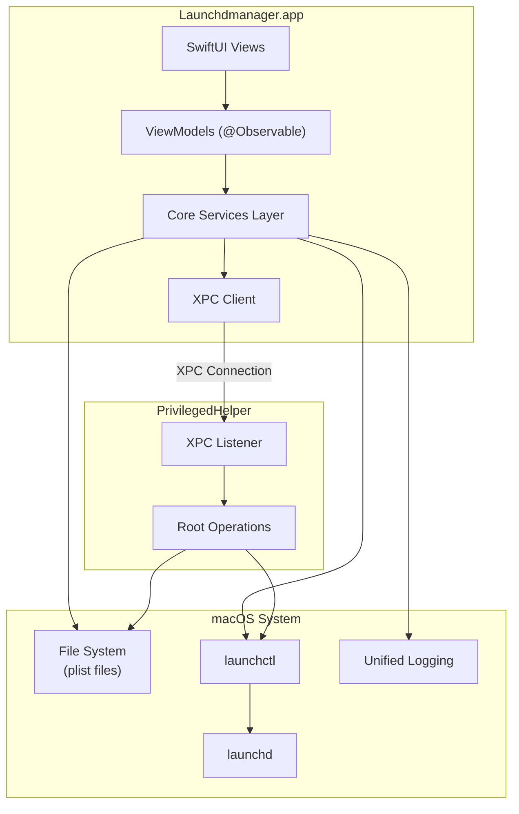

# Launchdmanager

<p align="center">
  
</p>

<p align="center">
  A native, modern, and powerful launchd service manager for macOS. Fully built with SwiftUI and Swift 6.
</p>

<p align="center">
  ⚠️ <b>Note</b>: This is an early development version (v0.0.1). High-risk system operations should be performed with caution.
</p>

<p align="center">
  Read this in: <b><a href="README_zh.md">🇨🇳 简体中文</a></b>
</p>

---

**Launchdmanager** is a professional desktop utility for macOS designed to inspect, create, edit, schedule, and monitor `LaunchAgents` and `LaunchDaemons`. Positioned as a modern, lightweight, non-sandboxed alternative to tools like LingonX and LaunchControl, it offers a seamless native interface and advanced development integrations.

## 📐 Architecture



## 🌟 Key Features

* **Modern SwiftUI Interface**: Beautiful, responsive three-column layout supporting macOS Light and Dark modes.
* **Dual-Mode Plist Editor**: Switch effortlessly between a visual configuration form and a live, syntax-highlighted XML plist editor with bi-directional synchronization.
* **Privileged Helper Tool**: Fully integrated with macOS `SMAppService` and secure XPC communication to write and reload root-level Global Daemons safely.
* **Built-in Terminal Log Viewer**: Monitor standard output/error files or stream system Unified Logs directly inside the app, with filtering and font/theme customization.
* **Smart Diagnostics Engine**: Automatically scans configurations for warnings and errors (such as invalid paths, conflicts between KeepAlive and StartInterval, etc.) and provides troubleshooting tips.
* **Drag-and-Drop Plist Import**: Drag any `.plist` file from Finder. Known launchd services are instantly located in the list; external plists open dynamically in standalone windows.
* **Multi-Window Editing**: Double-click or choose "Open in New Window" to manage multiple configurations concurrently in dedicated windows.
* **macOS Shortcuts Integration**: Automate services via AppIntents. List all items or trigger actions (Load, Unload, Start, Stop, Enable, Disable) using the native Shortcuts app.
* **Undo & Redo Support**: Complete, fine-grained undo/redo history for property changes utilizing `UndoManager`.

## 🛠️ Tech Stack

* **Platform**: macOS 14.0+ (Sonoma or later)
* **Language**: Swift 6.0 (Strict concurrency checked)
* **UI Framework**: SwiftUI (100% Native)
* **Project Generation**: XcodeGen
* **Dependencies**:
  - `CodeEditor` (ZeeZide) - SwiftPM dependency for XML syntax-highlighted editor.
  - `Highlightr` - Highlighting engine for logs.
* **Sandbox**: Disabled (required for system-wide service discovery, launchctl boots, and helper tools).

## 🚀 Getting Started

### Prerequisites

You need Xcode 15+ and [XcodeGen](https://github.com/yonaskolb/XcodeGen) installed on your Mac.

```bash
brew install xcodegen
```

### Build & Run

1. Clone this repository to your local drive:
   ```bash
   git clone https://github.com/SteveShi/Launchdmanager.git
   cd Launchdmanager
   ```

2. Generate the Xcode Project using XcodeGen:
   ```bash
   xcodegen generate
   ```

3. Open the project in Xcode:
   ```bash
   open Launchdmanager.xcodeproj
   ```

4. Select the **LaunchdManage** scheme, configure your local signing options, and press `Cmd+R` to build and run the application.

## 📦 Helper Tool Installation

To manage services under `/Library/LaunchDaemons` (requires root privileges), you need to register the helper tool:
1. Open the application and press `Cmd + ,` to open **Settings**.
2. Navigate to the **Helper Tool** tab.
3. Click **Install Helper Tool** and authorize with your macOS administrator password.
4. The status indicator should turn green and show **Active**.

## 🤝 Contribution

Contributions are welcome! Please open an Issue to discuss architectural changes or submit a Pull Request directly.

## 📄 License

This project is licensed under the MIT License - see the [LICENSE](LICENSE) file for details.
