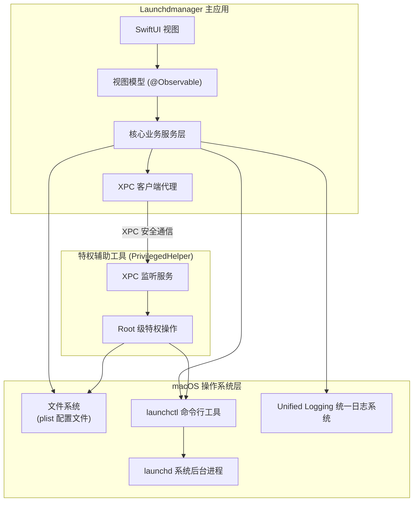

# Launchdmanager

<p align="center">
  
</p>

<p align="center">
  适用于 macOS 的原生、现代且功能强劲的 launchd 服务管理器。基于 SwiftUI 与 Swift 6 全新构建。
</p>

<p align="center">
  ⚠️ <b>提示</b>：当前为初期开发版本 (v0.0.1)，涉及系统特权的高风险操作请谨慎使用。
</p>

<p align="center">
  阅读英文版本：<b><a href="README.md">🇺🇸 English</a></b>
</p>

---

**Launchdmanager** 是一款专为 macOS 设计的专业系统级桌面管理工具，用于浏览、创建、编辑、调度以及监控 `LaunchAgents` 与 `LaunchDaemons`。本软件定位为 LingonX 和 LaunchControl 的现代化、轻量化、非沙盒替代方案，提供优雅的原生交互与强大的开发调试集成。

## 📐 架构设计



## 🌟 核心功能

* **现代 SwiftUI 界面**：采用精美、响应迅速的三栏式布局，完美适配 macOS 浅色和深色外观。
* **双模 Plist 编辑器**：支持在可视化属性表单和带语法高亮的 XML Plist 原始编辑器之间热切换，数据双向实时同步，并附带脏状态（未保存）警报。
* **特权辅助工具**：深度集成 macOS 现代的 `SMAppService` 并通过安全的 XPC 进程进行通信，无需每次手动输入密码即可安全读写和管理需要 root 权限的系统守护进程（Global Daemons）。
* **内置终端日志查看器**：可直接在软件内以终端风格查看服务的 standardOut/standardError 重定向输出或流式读取系统统一日志（Unified Log），支持日志级别过滤、关键字检索和字号/背景主题随心定制。
* **智能配置诊断系统**：内置诊断引擎（Diagnostics Engine），能自动扫描配置并检测潜在隐患（如可执行程序或重定向目录不存在，KeepAlive 与运行周期冲突等）并提出直观的修正指引。
* **拖拽导入 Plist**：支持直接从 Finder 中拖拽任意 `.plist` 配置文件。若是系统标准 launchd 目录下的已知服务将自动定位并选中；若是外部未知 Plist，将以独立编辑器窗口打开。
* **多窗口并行编辑**：支持通过双击或右键菜单 “Open in New Window” 打开独立的 Plist 编辑窗口，方便同时管理和对比多个服务配置。
* **macOS 快捷指令集成**：全面集成 AppIntents，支持通过系统的“快捷指令”应用列出所有服务或对指定服务批量触发自动化控制（Load、Unload、Start、Stop、Enable、Disable）。
* **撤销与重做（Undo/Redo）**：表单组件深度整合了系统级 `UndoManager`，支持使用 `Cmd+Z` 和 `Cmd+Shift+Z` 进行单个表单配置项更改的安全回滚。

## 🛠️ 技术栈

* **系统要求**：macOS 14.0+ (Sonoma 或更高版本)
* **编写语言**：Swift 6.0 (严格开启并发安全检查)
* **UI 框架**：SwiftUI (100% 纯原生)
* **项目生成**：XcodeGen
* **三方依赖**：
  - `CodeEditor` (ZeeZide) - 用于 XML 语法高亮预览的 SwiftPM 库。
  - `Highlightr` - 用于日志颜色渲染。
* **沙盒状态**：禁用沙盒 (非沙盒，扫描系统文件夹、管理系统级 plist 以及注册特权工具必需)

## 🚀 快速上手

### 准备工作

您的 Mac 上需要安装 Xcode 15+ 并配置好 [XcodeGen](https://github.com/yonaskolb/XcodeGen)：

```bash
brew install xcodegen
```

### 编译与运行

1. 克隆本项目仓库至本地：
   ```bash
   git clone https://github.com/SteveShi/Launchdmanager.git
   cd Launchdmanager
   ```

2. 使用 XcodeGen 生成 Xcode 项目工程文件：
   ```bash
   xcodegen generate
   ```

3. 用 Xcode 打开生成的项目：
   ```bash
   open Launchdmanager.xcodeproj
   ```

4. 选择 **LaunchdManage** Scheme 目标，在 Signing 页面设置您的本地开发者签名，按下快捷键 `Cmd+R` 编译并运行。

## 📦 特权辅助工具安装

如需管理 `/Library/LaunchDaemons` 下需要 root 权限的服务，您需要安装特权工具：
1. 启动应用，使用快捷键 `Cmd + ,` 唤起**偏好设置**窗口。
2. 切换到 **Helper Tool** 标签页。
3. 点击 **Install Helper Tool** 按钮，并输入您的 macOS 开机管理员密码以授权。
4. 状态指示器点亮绿色，并显示 **Active** 即可。

## 🤝 贡献指南

欢迎任何形式的贡献！如需对核心架构作出较大改动，请先提交 Issue 共同讨论；如果是常规修改或 Bug 修复，欢迎直接提交 Pull Request。

## 📄 开源许可

本项目基于 MIT 许可证开源，详情参见 [LICENSE](LICENSE) 文件。
